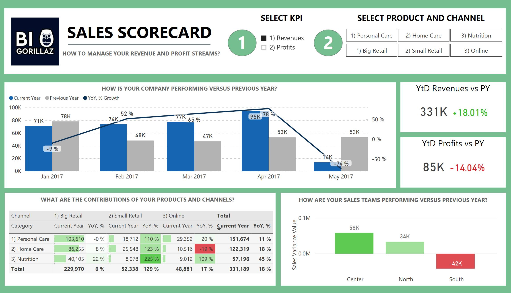
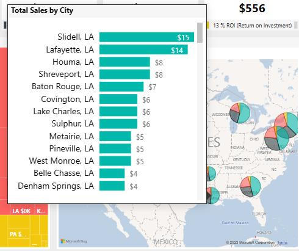
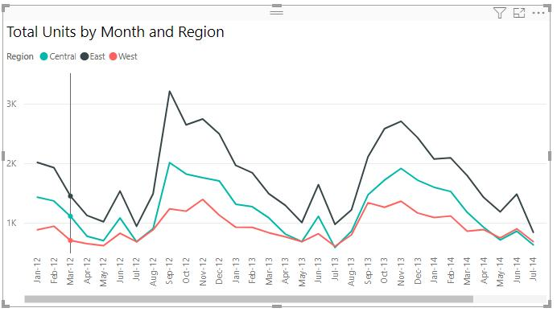

# 📊 Sales Performance Dashboard (Power BI)

## 🔍 Overview

This project presents an interactive **Sales Dashboard** built using Power BI to analyze business performance and support data-driven decision making.

The dashboard provides insights into sales trends, customer behavior, and regional performance.

---

## 📸 Dashboard Preview





---

## 📊 Key Features

* 📌 KPI tracking (Total Sales, Profit, Quantity)
* 🌍 Sales by Region and Country
* 📈 Monthly and yearly trends
* 🧑‍💼 Customer segmentation
* 📦 Product category performance

---

## 🛠 Tools & Technologies

* Power BI
* DAX (Data Analysis Expressions)
* Power Query
* Excel (data source)

---

## 📁 Project Structure

```
📁 powerbi-sales-dashboard
 ┣ 📁 data
 ┣ 📁 images
 ┣ 📄 sales_dashboard.pbix
 ┗ 📄 README.md
```

---

## 🚀 How to Use

1. Download the `.pbix` file
2. Open it using Power BI Desktop
3. Explore the interactive dashboard

---

## 🎯 Business Insights

This dashboard helps to:

* Identify top-performing regions
* Monitor sales growth over time
* Analyze customer purchasing behavior
* Support strategic decision-making

---

## 👤 Author

**Fatma Messaoudi**

---

## 💡 Notes

This project is part of my learning journey in data analytics and business intelligence using Power BI.
